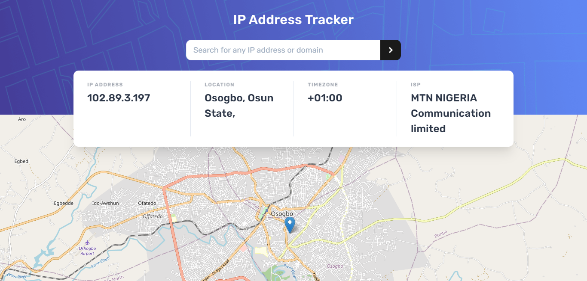

[](https://github.com/prettier/prettier)
[](https://github.com/calvin-puram/Ip_address_tracker/LICENSE)

</p>
<p align="center">
 <h3 align="center">IP Tracker App</h3>
  <p align="center">
    <br />
    <a href="https://ip-address-tracker-rho.vercel.app/"><strong>View Demo »</strong></a>
    <br />
    <br />
    <a href="https://github.com/calvin-puram/Ip_address_tracker/issues">Report Bug</a>
    ·
    <a href="https://github.com/calvin-puram/Ip_address_tracker/issues">Request Feature</a>
  </p>
</p>

## Table of Contents

- [About the Project](#about-the-project)
  - [Built With](#built-with)
- [Getting Started](#getting-started)
  - [Prerequisites](#prerequisites)
  - [Installation](#installation)
- [Contributing](#contributing)
- [License](#license)
- [Contact](#contact)

## About DevCoach App



IP Address Tracker App where users can search for any IP addresses or domains and see key information and location using the IP Geolocation API by IPify.


### Built With

List of major technologies use to build IP Address Tracker App.

- [Reactjs/Nextjs](https://nextjs.org/)
- [Typescript](https://www.typescriptlang.org/)

## Getting Started

To get a local copy up and running follow these simple steps.

### Prerequisites

- npm

```sh
npm install npm@latest -g
```

### Installation

1. Clone the repo

```sh
git clone https://github.com/calvin-puram/Ip_address_tracker.git
```

2. Install NPM packages

```sh
npm install
```

3. Enter your API key in `.env`

```JS
 KEY = 'ENTER YOUR API';
```

4. Start the project in development

```sh
npm run dev
```

## Contributing

To contribute to this project follow the steps below. Any contributions you make are **greatly appreciated**.

1. Fork the Project
2. Create your Feature Branch (`git checkout -b feature/AmazingFeature`)
3. Commit your Changes (`git commit -m 'Add some AmazingFeature'`)
4. Push to the Branch (`git push origin feature/AmazingFeature`)
5. Open a Pull Request

## License

Distributed under the MIT License. See `LICENSE` for more information.

## Contact

Your Name - [Calvin Puram](https://twitter.com/cpuram1) - puram.calvin@gmail.com

Project Live: [IP_Address_Tracker](https://ip-address-tracker-rho.vercel.app/)
